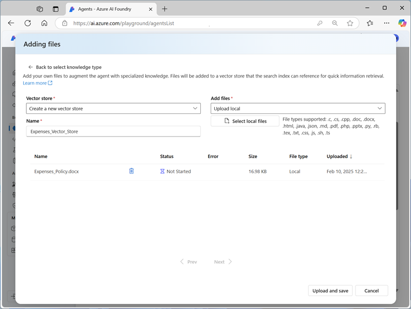

---
lab:
    title: 'Explore AI Agent development'
    description: 'Take your first steps in developing AI agents by exploring the Azure AI Agent service tools in the Azure AI Foundry portal.'
---

# Explore AI Agent development

In this exercise, you use the Azure AI Agent service tools in the Azure AI Foundry portal to create a simple AI agent that answers questions about expense claims.

This exercise takes approximately **30** minutes.

## Create an Azure AI Foundry project

Let's start by creating an Azure AI Foundry project.

1. In a web browser, open the [Azure AI Foundry portal](https://ai.azure.com) at `https://ai.azure.com` and sign in using your Azure credentials. Close any tips or quick start panes that are opened the first time you sign in, and if necessary use the **Azure AI Foundry** logo at the top left to navigate to the home page, which looks similar to the following image:

    

1. In the home page, select **+ Create project**.
1. In the **Create a project** wizard, enter a suitable project name for (for example, `my-ai-project`) and if an existing hub is suggested, choose the option to create a new one. Then review the Azure resources that will be automatically created to support your hub and project.
1. Select **Customize** and specify the following settings for your hub:
    - **Hub name**: *A unique name - for example `my-ai-hub`*
    - **Subscription**: *Your Azure subscription*
    - **Resource group**: *Create a new resource group with a unique name (for example, `my-ai-resources`), or select an existing one*
    - **Location**: Select a region from the following:\*
        - australiaeast
        - eastus
        - eastus2
        - francecentral
        - swedencentral
    - **Connect Azure AI Services or Azure OpenAI**: *Create a new AI Services resource with an appropriate name (for example, `my-ai-services`) or use an existing one*
    - **Connect Azure AI Search**: Skip connecting

    > \* At the time of writing, these regions support the gpt-4 model for use in agents. Model quotas are constrained at the tenant level by regional quotas. In the event of a quota limit being reached later in the exercise, there's a possibility you may need to create another project in a different region.

1. Select **Next** and review your configuration. Then select **Create** and wait for the process to complete.
1. When your project is created, close any tips that are displayed and review the project page in Azure AI Foundry portal, which should look similar to the following image:

    

## Deploy a generative AI model

Now you're ready to deploy a generative AI language model to support your agent.

1. In the pane on the left for your project, in the **My assets** section, select the **Models + endpoints** page.
1. In the **Models + endpoints** page, in the **Model deployments** tab, in the **+ Deploy model** menu, select **Deploy base model**.
1. Search for the **gpt-4** model in the list, and then select and confirm it.
1. Deploy the model with the following settings by selecting **Customize** in the deployment details:
    - **Deployment name**: *A unique name for your model deployment - for example `gpt-4-model`*
    - **Deployment type**: Standard
    - **Model version**: 0613 *This is likely the default version*
    - **Connected AI resource**: *Select your Azure OpenAI resource connection*
    - **Tokens per Minute Rate Limit (thousands)**: 5K
    - **Content filter**: DefaultV2
    - **Enable dynamic quota**: Disabled
      
    > **Note**: Reducing the TPM helps avoid over-using the quota available in the subscription you are using. 5,000 TPM is sufficient for the data used in this exercise.
1. Wait for the deployment provisioning state to be **Completed**.

## Create an AI agent

Now that you have a model deployed, you're ready to build an AI agent. In this exercise, you'll build a simple agent that answers questions based on a corporate expenses policy. You'll download the expenses policy document, and use it as *grounding* data for the agent.

1. Open another browser tab, and download [Expenses_policy.docx](https://raw.githubusercontent.com/MicrosoftLearning/mslearn-ai-agents/main/Labfiles/01-agent-fundamentals/Expenses_Policy.docx) from `https://raw.githubusercontent.com/MicrosoftLearning/mslearn-ai-agents/main/Labfiles/01-agent-fundamentals/Expenses_Policy.docx`, saving it locally. This document contains details of the expenses policy for the fictional Contoso corporation.
1. Return to the browser tab containing the Azure AI Foundry portal, and in the navigation pane on the left, in the **Build and customize** section, select the **Agents** page.
1. Use the **+ New agent** button to create a new agent. Then, in the **Setup** pane for your new agent, set the **Agent name** to `ExpensesAgent`, ensure that the gp-4 model deployment you created previously is selected, and set the **Instructions** to `Answer questions related to expense claims`.

    

1. Further down in the **Setup** pane, next to the **Knowledge** header, select **+ Add**. Then in the **Add knowledge** dialog box, select **Files**.
1. In the **Adding files** dialog box, create a new vector store named `Expenses_Vector_Store`, uploading the **Expenses_policy.docx** local file that you downloaded previously.

    

1. In the **Setup** pane, in the **Knowledge** section, verify that **Expenses_Vector_Store** is listed and shown as containing 1 file.

    > **Note**: You can also add **Actions** to an agent to automate tasks. In this simple information retrieval agent example, no actions are required.

## Test your agent

Now that you've created an agent, you can test it in the Azure AI Foundry portal playground.

1. At the top of the **Setup** pane for your agent, select **Try in playground**.
1. In the playground, enter the prompt `What's the maximum I can claim for meals?` and review the agent's response - which should be based on information in the expenses policy document you added as knowledge to the agent setup.

    

1. Continue chatting with your agent, asking expenses related questions and reviewing the responses.

## Clean up

Now that you've finished the exercise, you should delete the cloud resources you've created to avoid unnecessary resource usage.

1. Open the [Azure portal](https://portal.azure.com) at `https://portal.azure.com` and view the contents of the resource group where you deployed the hub resources used in this exercise.
1. On the toolbar, select **Delete resource group**.
1. Enter the resource group name and confirm that you want to delete it.
