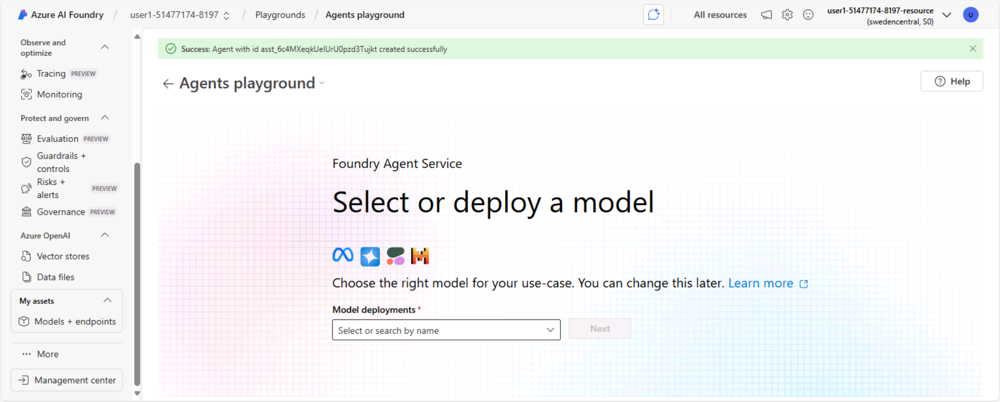
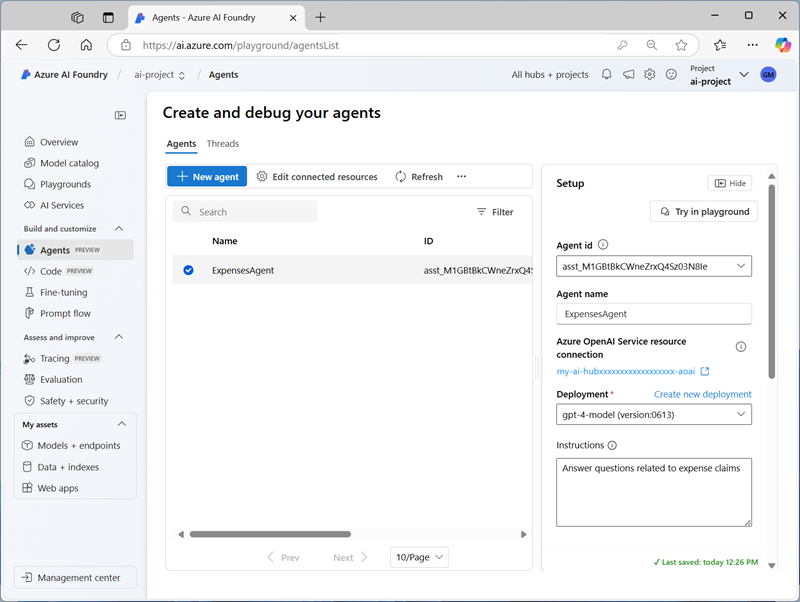
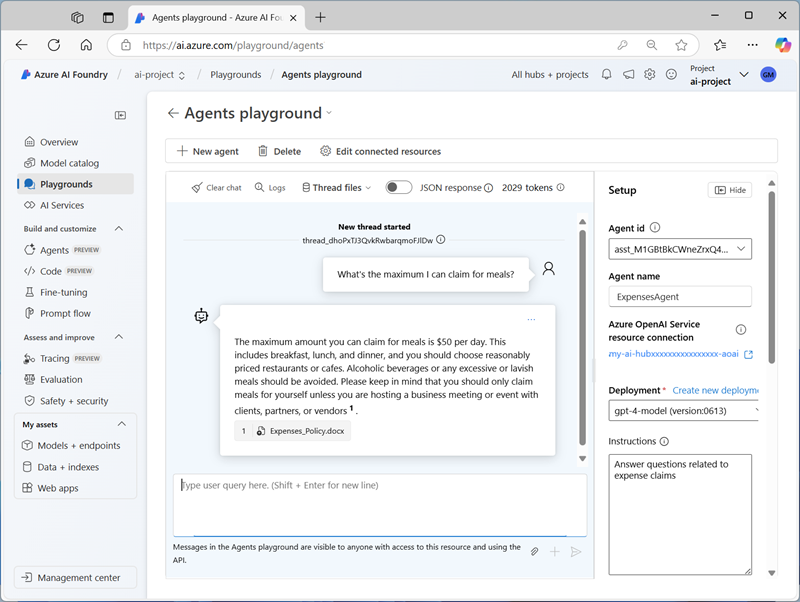

---
lab:
    title: 'Explore AI Agent development'
    description: 'Take your first steps in developing AI agents by exploring the Azure AI Agent service in the Azure AI Foundry portal.'
---

# Explore AI Agent development

In this exercise, you use the Azure AI Agent service in the Azure AI Foundry portal to create a simple AI agent that assists employees with expense claims.

This exercise takes approximately **30** minutes.

> **Note**: Some of the technologies used in this exercise are in preview or in active development. You may experience some unexpected behavior, warnings, or errors.

## Create an Azure AI Foundry project and agent

Let's start by creating an Azure AI Foundry project.

1. In a web browser, open the [Azure AI Foundry portal](https://ai.azure.com) at `https://ai.azure.com` and sign in using your Azure credentials. Close any tips or quick start panes that are opened the first time you sign in, and if necessary use the **Azure AI Foundry** logo at the top left to navigate to the home page, which looks similar to the following image (close the **Help** pane if it's open):

    

1. In the home page, select **Create an agent**.
1. When prompted to create a project, enter a valid name for your project.
1. Expand **Advanced options** and specify the following settings:
    - **Azure AI Foundry resource**: *A valid name for your Azure AI Foundry resource*
    - **Subscription**: *Your Azure subscription*
    - **Resource group**: *Select your resource group, or create a new one*
    - **Region**: *Select any **AI Services supported location***\*

    > \* Some Azure AI resources are constrained by regional model quotas. In the event of a quota limit being exceeded later in the exercise, there's a possibility you may need to create another resource in a different region.

1. Select **Create** and wait for your project to be created.
1. If prompted, deploy a **gpt-4o** model using the **Global standard** or **Standard** deployment type (depending on quota availability) and customize the deployment details to set a **Tokens per minute rate limit** of 50K (or the maximum available if less than 50K).

    > **Note**: Reducing the TPM helps avoid over-using the quota available in the subscription you are using. 50,000 TPM should be sufficient for the data used in this exercise. If your available quota is lower than this, you will be able to complete the exercise but you may experience errors if the rate limit is exceeded.

1. When your project is created, the Agents playground will be opened automatically so you can select or deploy a model:

    

    >**Note**: A GPT-4o base model is automatically deployed when creating your Agent and project.

You'll see that an agent with a default name has been created for you, along with your base model deployment.

## Create your agent

Now that you have a model deployed, you're ready to build an AI agent. In this exercise, you'll build a simple agent that answers questions based on a corporate expenses policy. You'll download the expenses policy document, and use it as *grounding* data for the agent.

1. Open another browser tab, and download [Expenses_policy.docx](https://raw.githubusercontent.com/MicrosoftLearning/mslearn-ai-agents/main/Labfiles/01-agent-fundamentals/Expenses_Policy.docx) from `https://raw.githubusercontent.com/MicrosoftLearning/mslearn-ai-agents/main/Labfiles/01-agent-fundamentals/Expenses_Policy.docx` and save it locally. This document contains details of the expenses policy for the fictional Contoso corporation.
1. Return to the browser tab containing the Foundry Agents playground, and find the **Setup** pane (it may be to the side or below the chat window).
1. Set the **Agent name** to `ExpensesAgent`, ensure that the gpt-4o model deployment you created previously is selected, and set the **Instructions** to:

    ```prompt
   You are an AI assistant for corporate expenses.
   You answer questions about expenses based on the expenses policy data.
   If a user wants to submit an expense claim, you get their email address, a description of the claim, and the amount to be claimed and write the claim details to a text file that the user can download.
    ```

    

1. Further down in the **Setup** pane, next to the **Knowledge** header, select **+ Add**. Then in the **Add knowledge** dialog box, select **Files**.
1. In the **Adding files** dialog box, create a new vector store named `Expenses_Vector_Store`, uploading and saving the **Expenses_policy.docx** local file that you downloaded previously.
1. In the **Setup** pane, in the **Knowledge** section, verify that **Expenses_Vector_Store** is listed and shown as containing 1 file.
1. Below the **Knowledge** section, next to **Actions**, select **+ Add**. Then in the **Add action** dialog box, select **Code interpreter** and then select **Save** (you do not need to upload any files for the code interpreter).

    Your agent will use the document you uploaded as its knowledge source to *ground* its responses (in other words, it will answer questions based on the contents of this document). It will use the code interpreter tool as required to perform actions by generating and running its own Python code.

## Test your agent

Now that you've created an agent, you can test it in the playground chat.

1. In the playground chat entry, enter the prompt: `What's the maximum I can claim for meals?` and review the agent's response - which should be based on information in the expenses policy document you added as knowledge to the agent setup.

    > **Note**: If the agent fails to respond because the rate limit is exceeded. Wait a few seconds and try again. If there is insufficient quota available in your subscription, the model may not be able to respond. If the problem persists, try to increase the quota for your model on the **Models + endpoints** page.

1. Try the following follow-up prompt: `I'd like to submit a claim for a meal.` and review the response. The agent should ask you for the required information to submit a claim.
1. Provide the agent with an email address; for example, `fred@contoso.com`. The agent should acknowledge the response and request the remaining information required for the expense claim (description and amount)
1. Submit a prompt that describes the claim and the amount; for example, `Breakfast cost me $20`.
1. The agent should use the code interpreter to prepare the expense claim text file, and provide a link so you can download it.

    

1. Download and open the text document to see the expense claim details.

## Clean up

Now that you've finished the exercise, you should delete the cloud resources you've created to avoid unnecessary resource usage.

1. Open the [Azure portal](https://portal.azure.com) at `https://portal.azure.com` and view the contents of the resource group where you deployed the hub resources used in this exercise.
1. On the toolbar, select **Delete resource group**.
1. Enter the resource group name and confirm that you want to delete it.
