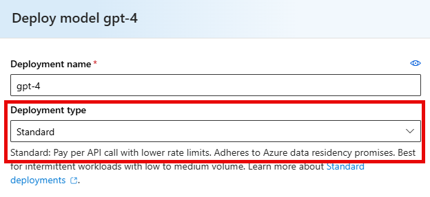

---
lab:
    title: 'Implement custom tools in an AI agent'
    description: 'Learn how define callback functions as function tools to add capabilities to your agents.'
---

# Implement custom tools in an AI agent

In this exercise you will explore enhancing your Agents by defining callback functions as function tools.

Tasks performed in this exercise:

* Create an Azure AI Foundry project and deploy a model
* Develop an agent with function tools
* Clean up resources

This exercise should take approximately **30** minutes to complete.

## Before you start

To complete this exercise, you'll need:

* [Python](https://www.python.org/downloads/) installed on your machine. Version 3.11 or greater recommended.
* An Azure subscription. If you don't already have one, you can [sign up for one](https://azure.microsoft.com/).
* [Visual Studio Code](https://code.visualstudio.com/Download) installed. The [Python extension](https://marketplace.visualstudio.com/items?itemName=ms-python.python) is recommended.
* [Git](https://git-scm.com/book/en/v2/Getting-Started-Installing-Git) installed on your machine.
* An Azure subscription. If you don't already have one, you can [sign up for one](https://azure.microsoft.com/)
* The [Azure CLI](https://learn.microsoft.com/cli/azure/install-azure-cli) installed locally. 

## Create an Azure AI Foundry project

Let's start by creating an Azure AI Foundry project.

1. In a web browser, open the [Azure AI Foundry portal](https://ai.azure.com) at `https://ai.azure.com` and sign in using your Azure credentials. Close any tips or quick start panes that might open.
1. In the home page, select **+ Create project**.
1. In the **Create a project** wizard, enter project name or accept the name provided.
1. If you don't have a hub yet created, you'll see the new hub name and can expand the section below to review the Azure resources that will be automatically created to support your project. If you are reusing a hub, skip the following step.
1. Select **Customize** and specify the following settings for your hub:

    | Setting | Value |
    |--|--|
    | Hub name | You can accept the provided name, or enter your own unique name - for example `my-ai-hub`. |  |
    | Subscription | Your Azure subscription. |
    | Resource group | Create a new resource group with a unique name (for example, `my-ai-resources`). |
    | Location | Select **Help me choose** and then select **gpt-4** in the Location helper window and use the recommended region. |
    | Connect Azure AI Services or Azure OpenAI | Create a new AI Services resource with an appropriate name (for example, `my-ai-services`) or use an existing one.

    >**Note:** Model quotas are constrained at the tenant level by regional quotas. In the event of a quota limit being reached later in the exercise, there's a possibility you may need to create another project in a different region.

1. Select **Next** and review your configuration. Then select **Create** and wait for the process to complete.

### Add a model to your project

1. After the deployment process completes, add a model to your project by selecting **Models + endpoints** in the **My assets** section of the navigation pane.
1. Select the **+ Deploy model**  drop down, and then select **Deploy base model**.
1. Select **gpt-4** from the list of available models, and then select **Confirm**. 
1. In the **Deploy model gpt-4** screen, select **Standard** in the drop-down box under **Deployment type**. Verify the **Model version** is set to *0613 (Default)*. Do not change any other values.

    

1. Select **Deploy** to deploy the model to your project.

## Develop an agent with function tools

Now that you've created your project in AI Foundry, let's develop an app that implements an agent using custom function tools.

### Prepare the application configuration

Let's download the code and configure the application.

1. In the Azure AI Foundry portal, view the **Overview** page for your project.
1. In the **Project details** area, note the **Project connection string**. You'll use this connection string to connect to your project in a client application.
1. Open VS Code and **Clone** the `https://github.com/MicrosoftLearning/mslearn-ai-agents` repository.
1. Store the clone on a local drive, and open the folder after cloning.
1. In the VS Code Explorer (left pane), right-click on the **Labfiles/03-enhance-ai-agent/Python** folder and select **Open in Integrated Terminal**.
1. Run the following command in the terminal to create a virtual environment for the project. This ensures your project is using the correct libraries.

    ```bash
    python -m venv .venv
    ```

1. Wait for the environment to be created, then run the following command in the terminal to activate the environment. After activation you should see a `(.venv)` indicator next to the command prompt.

    ```bash
    .venv\Scripts\activate
    ```

1. The *requirements.txt* file in the project contains all of the required libraries. In the terminal, enter the following command to install the Python libraries you'll use, which are:
    - **python-dotenv** : Used to load settings from an application configuration file.
    - **azure-identity**: Used to authenticate with Entra ID credentials.
    - **azure-ai-projects**: Used to work with an Azure AI Foundry project, version 1.0.0b6.

    ```powershell
    pip install -r requirements.txt
    ```

1. In the VS Code Explorer (left pane), open the **.env** Python configuration file.
1. Replace the **your_project_endpoint** placeholder with the connection string for your project (copied from the project **Overview** page in the Azure AI Foundry portal).
1. After you've replaced the placeholders, save your changes.

### Write code to connect to your project and chat with your model

Now that you've configured the app, you'll add the necessary code to build an agent that uses a custom function. In Visual Studio Code, you'll need to sign into your Azure subscription. Run the with `az login` command in the terminal and login using the same account you used to create the AI Foundry project.

1. In the VS Code Explorer (left pane), open the **agent-tool-starter.py** code file.
1. Review the included libraries, taking note of the *Azure AI Projects* libraries for the client and tools.
1. Add the following code in the `# Define the function and toolset` section to create the definition and add it to `FunctionTool`. 

    ```python
    def add_disclaimer(email: str) -> str:
        """
        Adds a disclaimer to the email content.
        :param email (str): The email content.
        :return: Email content with disclaimer.
        :rtype: str
        """
        disclaimer = "\n\nThis is an automated email. Please do not reply."
        return email + disclaimer
    
    functions = FunctionTool({add_disclaimer})
    ```

1. Save the file and review the code you just added. The function receives the email from the agent, appends the disclaimer to the email, and returns the result to the agent. 

Now that the `FunctionTool` is defined, you need to add code to monitor the agent run status and handle the function calls.

1. Add the following code in the `# Monitor and process the run status, and handle the function calls` section to create the definition and add it to `FunctionTool`.

    ```python
    while run.status in ["queued", "in_progress", "requires_action"]:
        time.sleep(1)
        run = project_client.agents.get_run(thread_id=thread.id, run_id=run.id)
    
        # Handle required actions (function calls)
        if run.status == "requires_action" and run.required_action.type == "submit_tool_outputs":
            print("Tool execution required")
            tool_calls = run.required_action.submit_tool_outputs.tool_calls
            tool_outputs = []
            
            # Process each tool call
            for tool_call in tool_calls:
                function_name = tool_call.function.name
                function_args = json.loads(tool_call.function.arguments)
                
                print(f"Executing function: {function_name}.")
                
                # Execute the appropriate function
                if function_name == "add_disclaimer":
                    email = function_args.get("email")
                    output = add_disclaimer(email)
                    tool_outputs.append({
                        "tool_call_id": tool_call.id,
                        "output": output
                    })
            
            # Submit the outputs back to the agent
            print(f"Submitting tool outputs: {tool_outputs}")
            run = project_client.agents.submit_tool_outputs_to_run(
                thread_id=thread.id,
                run_id=run.id,
                tool_outputs=tool_outputs
            )
        
        if run.status not in ["queued", "in_progress", "requires_action"]:
            break
    ```

1. Save the changes, and review the code you just added.

The code monitors the call to the agent. The `run.status` changes to `requires_action` if the agent determines it needs to use the function tool to process the request.

When it processes the request, the code:

* Retrieves the function names and required arguments from the defined tools.
* Determines which function to run and includes the arguments required by the function 
* Submits the output back to the agent

### Run the application

Now that the code is complete, it's time to run the application.

1. Run the following command in the terminal to run the app.

    ```bash
    python agent-tool-starter.py
    ```

1. When you are asked to enter a prompt, press **Enter** to accept the default prompt which will trigger the function. You should see output similar to the following example. **Note:** You can run the app again and enter your own prompt.

    ```
    Last Message: Here is the final version of the email with the added disclaimer:
    
    "Dear Customer,
    
    We are pleased to inform you that your order has been shipped. You can expect to receive it 
    within the customary shipping time. We appreciate your patience and your business.
    
    Best,
    [Your Company]
    
    This is an automated email. Please do not reply."
    ```

## Clean up

Now that you've finished the exercise, you should delete the cloud resources you've created to avoid unnecessary resource usage.

1. Open the [Azure portal](https://portal.azure.com) at `https://portal.azure.com` and view the contents of the resource group where you deployed the hub resources used in this exercise.
1. On the toolbar, select **Delete resource group**.
1. Enter the resource group name and confirm that you want to delete it.