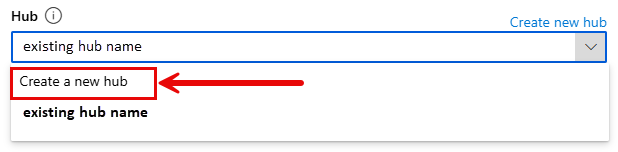

---
lab:
    title: 'Implement custom tools in an AI agent'
    description: 'Learn how define callback functions as function tools to add capabilities to your agents.'
---

# Implement custom tools in an AI agent

In this exercise you will explore creating an agent with a function call.

Tasks performed in this exercise:

* Create an Azure AI Foundry project and deploy a model
* Develop an agent that uses function tools
* Clean up resources

This exercise should take approximately **30** minutes to complete.

## Before you start

To complete this exercise, you'll need:

* An Azure subscription. If you don't already have one, you can [sign up for one](https://azure.microsoft.com/).

## Create an Azure AI Foundry project

Let's start by creating an Azure AI Foundry project.

1. In a web browser, open the [Azure AI Foundry portal](https://ai.azure.com) at `https://ai.azure.com` and sign in using your Azure credentials. Close any tips or quick start panes that might open.
1. In the home page, select **+ Create project**.
1. In the **Create a project** wizard, enter project name or accept the name provided.

1. If you don't have a hub yet created, you'll see the new suggested unique hub name with *(new)* to the left of the name. Select **Customize** to expand the section, and then use the settings in the following step. 

    If you have already created a hub for another project, you need to create a new one. Select the drop down to the right of the hub name and select **Create a new hub** and it will suggest a new unique name. Then select **Customize** to expand the section, and then use the settings in the following step. 

    

1. The following table shows the settings you should use after selecting  **Customize** in the previous step.:

    | Setting | Value |
    |--|--|
    | Hub name | Accept the suggested unique name. |
    | Subscription | Accept the default subscription for the account you used to sign in to AI Founcry, or select another subscription. |
    | Resource group | Accept the suggested new group, or create a with a unique name (for example, `my-ai-resources`) you choose. |
    | Location | Select **Help me choose** and then select **gpt-4** in the Location helper window and use the recommended region. |
    | Connect Azure AI Services or Azure OpenAI | No changes to this value.|
    | Connect Azure AI Search | No changes to this value.

    >**Note:** Model quotas are constrained at the tenant level by regional quotas. In the event of a quota limit being reached later in the exercise, there's a possibility you may need to create another project in a different region.

1. Select **Next** and review your configuration. Then select **Create** and wait for the process to complete.

### Add a model to your project

1. After the deployment process completes, add a model to your project by selecting **Models + endpoints** in the **My assets** section of the navigation pane.
1. Select the **+ Deploy model**  drop down, and then select **Deploy base model**.
1. Select **gpt-4** from the list of available models, and then select **Confirm**. 
1. Select **Customize** in the deployment details and use the settings in the following table.

    | Setting | Value |
    |--|--|
    | Deployment name | Leave the value as *gpt-4*. |
    | Deployment type | Select **Standard** from the drop down menu. |
    | Model version | The default version should be selected for you. If not, select the version with *(Default)* at the end of the version name. |
    | Connected AI resource | No changes |
    | Tokens per Minute Rate Limit | Adjust the slider to a value of **5K**. |
    | Content filter | Ensure **DefaultV2** is selected. |
    | Enable dynamic quota | Select **Disabled**. |

1. Select Deploy and wait for the deployment provisioning state to be **Completed**.

## Develop an agent that uses function tools

Now that you've created your project in AI Foundry, let's develop an app that implements an agent using custom function tools.

### Clone the repo containing the starter code

1. Open a new browser tab (keeping the Azure AI Foundry portal open in the existing tab). Then in the new tab, browse to the [Azure portal](https://portal.azure.com) at `https://portal.azure.com`; signing in with your Azure credentials if prompted.
1. Use the **[\>_]** button to the right of the search bar at the top of the page to create a new Cloud Shell in the Azure portal, selecting a ***PowerShell*** environment. The cloud shell provides a command line interface in a pane at the bottom of the Azure portal.

    > **Note**: If you have previously created a cloud shell that uses a *Bash* environment, switch it to ***PowerShell***.

1. In the cloud shell toolbar, in the **Settings** menu, select **Go to Classic version** (this is required to use the code editor).
1. In the PowerShell pane, enter the following commands to clone the GitHub repo containing the code files for this exercise:

    ```
   rm -r ai-agents -f
   git clone https://github.com/MicrosoftLearning/mslearn-ai-agents ai-agents
    ```

    > **Tip**: As you enter commands into the cloudshell, the ouput may take up a large amount of the screen buffer and the cursor on the current line may be obscured. You can clear the screen by entering the `cls` command to make it easier to focus on each task.

1. Enter the following command to change the working directory to the folder containing the code files and list them all.

    ```
   cd ai-agents/Labfiles/03-enhance-ai-agent/Python
   ls -a -l
    ```

    The provided files include application code and a file for configuration settings.

### Configure the application settings

1. In the cloud shell command line pane, enter the following command to install the libraries you'll use:

    ```
   pip install python-dotenv azure-identity azure-ai-projects==1.0.0b6
    ```

    >**Note:** You can ignore any warning or error messages displayed during the library installation.

1. Enter the following command to edit the configuration file that has been provided:

    ```
   code .env
    ```

    The file is opened in a code editor.

1. In the code file, replace the **your_project_connection_string** placeholder with the connection string for your project (copied from the project **Overview** page in the Azure AI Foundry portal).
1. After you've replaced the placeholders, use the **CTRL+S** command to save your changes and then use the **CTRL+Q** command to close the code editor while keeping the cloud shell command line open.

### Write code for an agent app

> **Tip**: As you add code, be sure to maintain the correct indentation.

### Write code to connect to your project and chat with your model

Now that you've configured the app, you'll add the necessary code to build an agent that uses a custom function. 

1. Enter the following command to begin editing the code.

    ```
    code agent-tool-starter.py
    ```

1. Add the following code in the `# Define the function and toolset` section. This code defines a function and adds it to the toolset. The agent uses the function when asked to draft an email to a customer. The agent sends the email to the function, and the function returns the email with the added disclaimer at the end.

    ```python
    def add_disclaimer(email: str) -> str:
        """
        Adds a disclaimer to the email content.
        :param email (str): The email content.
        :return: Email content with disclaimer.
        :rtype: str
        """
        disclaimer = "\n\nThis is an automated email. Please do not reply."
        return email + disclaimer
    
    # Add the disclaimer function to the toolset
    functions = FunctionTool({add_disclaimer})
    ```

Now that the `FunctionTool` is defined, you need to add code to monitor the agent run status and handle the function calls.

1. Add the following code in the `# Monitor and process the run status, and handle the function calls` section to monitor the agent and invoke the `FunctionTool` when needed.

    ```python
    while run.status in ["queued", "in_progress", "requires_action"]:
        time.sleep(1)
        run = project_client.agents.get_run(thread_id=thread.id, run_id=run.id)
    
        # Handle required actions (function calls)
        if run.status == "requires_action" and run.required_action.type == "submit_tool_outputs":
            print("Tool execution required")
            tool_calls = run.required_action.submit_tool_outputs.tool_calls
            tool_outputs = []
            
            # Process each tool call
            for tool_call in tool_calls:
                function_name = tool_call.function.name
                function_args = json.loads(tool_call.function.arguments)
                
                print(f"Executing function: {function_name}.")
                
                # Execute the appropriate function
                if function_name == "add_disclaimer":
                    email = function_args.get("email")
                    output = add_disclaimer(email)
                    tool_outputs.append({
                        "tool_call_id": tool_call.id,
                        "output": output
                    })
            
            # Submit the outputs back to the agent
            print(f"Submitting tool outputs: {tool_outputs}")
            run = project_client.agents.submit_tool_outputs_to_run(
                thread_id=thread.id,
                run_id=run.id,
                tool_outputs=tool_outputs
            )
        
        if run.status not in ["queued", "in_progress", "requires_action"]:
            break
    ```

1. Review the code you just entered. The code monitors the call to the agent. The `run.status` changes to `requires_action` if the agent determines it needs to use the function tool to process the request.

    The code monitors the call to the agent. The `run.status` changes to `requires_action` if the agent determines it needs to use the function tool to process the request. Otherwise the agent processes the request 
    
    When it processes the request, the code:

    * Retrieves the function names and required arguments from the defined tools.
    * Determines which function to run and includes the arguments required by the function 
    * Submits the output back to the agent

1. Use the **CTRL+S** command to save the changes, and then **CTRL+Q** to exit the editor.

### Sign into Azure and run the app

Now that the code is complete, it's time to run the application.

1. In the cloud shell command line pane, enter the following command to sign into Azure.

    ```
    az login
    ```
    
1. When prompted, follow the instructions to open the sign-in page in a new tab and enter the authentication code provided and your Azure credentials. Then complete the sign in process in the command line, selecting the subscription containing your Azure AI Foundry hub if prompted.

1. After you have signed in, enter the following command to run the application:

    ```
    python agent-tool-starter.py
    ```

1. When you are asked to enter a prompt, press **Enter** to accept the default prompt which will trigger the function. You should see output similar to the following example.

    >**Note:** You can run the app again and enter your own prompt. If you don't ask the agent to create a customer email, it will run without being processed by the function.

    ```
    Last Message: Here is the final version of the email with the added disclaimer:
    
    "Dear Customer,
    
    We are pleased to inform you that your order has been shipped. You can expect to receive it 
    within the customary shipping time. We appreciate your patience and your business.
    
    Best,
    [Your Company]
    
    This is an automated email. Please do not reply."
    ```

## Clean up

Now that you've finished the exercise, you should delete the cloud resources you've created to avoid unnecessary resource usage.

1. Open the [Azure portal](https://portal.azure.com) at `https://portal.azure.com` and view the contents of the resource group where you deployed the hub resources used in this exercise.
1. On the toolbar, select **Delete resource group**.
1. Enter the resource group name and confirm that you want to delete it.